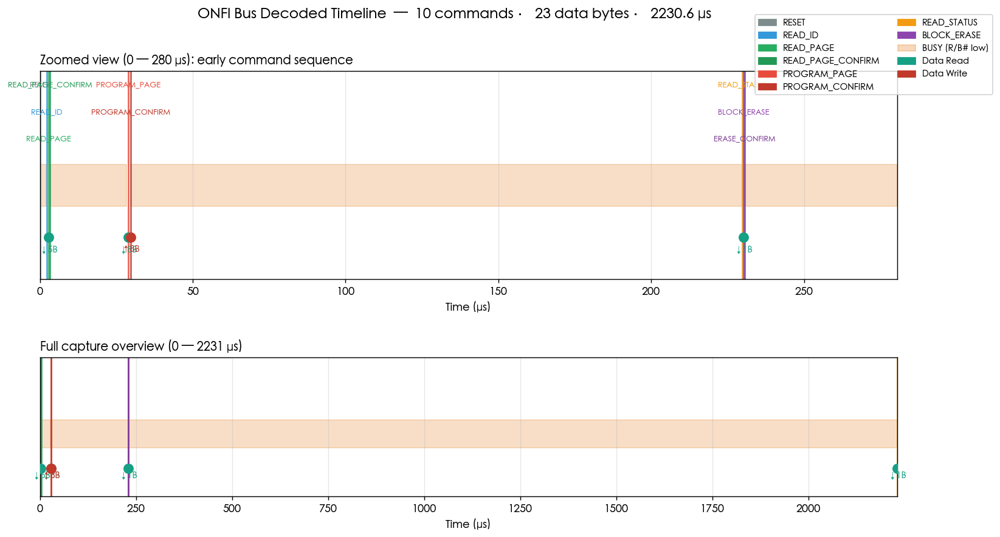

# ONFI 协议解码器 (ONFI Decoder)

> Python 实现的 ONFI (Open NAND Flash Interface) 总线协议解码器，可以把逻辑分析仪抓到的原始波形 CSV 直接解码为人类可读的命令序列。

[](https://www.python.org/downloads/)
[](https://opensource.org/licenses/MIT)
[](#测试)

## 这个项目解决什么问题

调试 NAND Flash 控制器（如 U 盘 / SSD 固件开发）时，工程师常用逻辑分析仪挂在主控芯片和 NAND die 之间的并行 ONFI 总线上抓信号 (`CE#`、`CLE`、`ALE`、`WE#`、`RE#`、`R/B#`、`IO[7:0]`)。

抓到的波形包含丰富的命令信息，但**几乎没法直接看波形读懂**。Sigrok / PulseView、Saleae Logic 2 自带几十个协议解码器，**但偏偏没有 ONFI**。

本项目填补这个空白：解析 CSV 抓包，输出每条 ONFI 命令的命令名、地址（块号 / 页号 / 列地址）、数据方向与字节、状态寄存器位级解析、忙/就绪状态切换。

---

## 功能特性

- ✅ **支持 Async ONFI 1.x ~ 4.x** 命令集（50+ 操作码 + 中文描述）
- ✅ **地址解码** — Page Read / Program / Erase 自动拆分为 Column / Row / Block / Page
- ✅ **状态寄存器位级解析** — RDY / ARDY / FAIL / WP 等所有状态位
- ✅ **Read ID 解读** — 自动识别厂商（Micron / Hynix / Samsung / Toshiba / SanDisk 等）
- ✅ **R/B# 边沿跟踪** — 标注芯片忙/就绪切换
- ✅ **CLI 命令行工具** (`onfi-decode`) + Python API
- ✅ **JSON / 文本输出** — 方便对接其他工具
- ✅ **时序图可视化** — matplotlib 双面板（缩放区 + 总览）
- ✅ 默认支持 Saleae Logic 2 CSV 格式；可扩展 Kingst / PulseView

---

## 安装

```bash
git clone https://github.com/DavidLiu0536/onfi-decoder.git
cd onfi-decoder
pip install -e .
```

依赖：Python 3.8+，`matplotlib`

---

## 快速上手

### 1. 生成模拟抓包（如果还没有自己的抓包数据）

```bash
python examples/gen_sample_capture.py
```

会生成 `examples/sample_capture.csv`，包含一段典型操作序列：
**Reset → Read ID → Page Read → Page Program → Block Erase → Read Status**

### 2. 运行解码

```bash
onfi-decode examples/sample_capture.csv
```

输出示例：

```
================================================================================
ONFI 解码报告
================================================================================
命令数  : 10
数据字节: 23
────────────────────────────────────────────────────────────────────────────────
[    0.050 us] CMD  : 0xFF  RESET                     -- 全芯片复位
[    0.075 us] R/B# : 芯片忙
[    2.075 us] R/B# : 芯片就绪
[    2.225 us] CMD  : 0x90  READ_ID                   -- 读厂商/设备 ID（5 字节）
[    2.300 us] ADDR : addr=0x00  (raw: 00)
[    2.900 us] DATA ←: 2C DC 90 95 06  (5 字节)
           └─ Read ID: Mfr=0x2C (Micron / Crucial), Dev=0xDC, Int=0x90, ...
[    2.900 us] CMD  : 0x00  READ_PAGE                 -- 页读（第 1 周期，需后续 0x30）
[    3.275 us] ADDR : COL=0x0010, ROW=0x010080 (Block=1026, Page=0)
[    3.350 us] CMD  : 0x30  READ_PAGE_CONFIRM         -- 页读确认
[    3.375 us] R/B# : 芯片忙
[   28.375 us] R/B# : 芯片就绪
[   28.985 us] DATA ←: DE AD BE EF 12 34 56 78  (8 字节)
[   28.985 us] CMD  : 0x80  PROGRAM_PAGE              -- 页编程
[   29.360 us] ADDR : COL=0x0000, ROW=0x020100 (Block=2052, Page=0)
[   29.795 us] DATA →: CA FE BA BE F0 0D C0 DE  (8 字节)
[   29.795 us] CMD  : 0x10  PROGRAM_CONFIRM
[   29.820 us] R/B# : 芯片忙
[  229.820 us] R/B# : 芯片就绪
[  229.870 us] CMD  : 0x70  READ_STATUS               -- 读状态寄存器
[  230.190 us] DATA ←: E0  (1 字节)
           └─ Status=0xE0: WP, RDY, ARDY
[  230.190 us] CMD  : 0x60  BLOCK_ERASE
[  230.415 us] ADDR : ROW=0x000040 (整块擦除)
[  230.490 us] CMD  : 0xD0  ERASE_CONFIRM
[ 2230.515 us] R/B# : 芯片就绪
[ 2230.620 us] DATA ←: E0  (1 字节)
           └─ Status=0xE0: WP, RDY, ARDY
```

### 3. 出时序图

```python
from onfi_decoder import OnfiDecoder
from onfi_decoder.visualize import plot_timeline

dec = OnfiDecoder()
dec.decode_csv('examples/sample_capture.csv')
plot_timeline(dec, 'timeline.png')
```



---

## CSV 格式约定

默认接受 Saleae Logic 2 的 CSV 导出格式。必需列（区分大小写）：

```
Time[s], CE#, CLE, ALE, WE#, RE#, R/B#, IO[7:0]
```

字段说明：
- `Time[s]` —— 时间戳，单位秒（浮点）
- 单 bit 信号（`CE#`, `CLE`, …）—— 取值 `0` 或 `1`
- `IO[7:0]` —— 十六进制字符串 (`0xAB`) 或十进制

其他抓包工具（Kingst、PulseView .sr 等）可以通过在 `onfi_decoder/parsers/` 增加适配器支持，欢迎提 PR。

---

## Python API 用法

```python
from onfi_decoder import OnfiDecoder

dec = OnfiDecoder()
dec.decode_csv('capture.csv')

# 统计信息
print(dec.stats())
# {'total_events': 28, 'commands_total': 10, 'data_bytes_total': 23,
#  'duration_us': 2230.62,
#  'commands_breakdown': {'RESET': 1, 'READ_ID': 1, 'READ_PAGE': 1, ...}}

# 遍历所有事件
for event in dec.events:
    if event.kind == 'CMD':
        print(event.raw['name'], event.raw['byte'])
```

---

## CLI 命令行

```
onfi-decode <csv> [-f text|json] [-o output.txt] [--stats]

选项:
  -f, --format text|json      输出格式（默认 text）
  -o, --output 文件            保存到文件（默认输出到 stdout）
  --stats                     仅打印解码统计 (JSON)
```

示例：

```bash
# 文本格式解码日志
onfi-decode capture.csv

# JSON 输出供下游工具处理
onfi-decode capture.csv -f json -o decoded.json

# 仅打印统计
onfi-decode capture.csv --stats
```

---

## 已支持的命令

| 操作码 | 命令名 | 说明 |
|---|---|---|
| 0xFF | RESET | 全芯片复位 |
| 0xFC | SYNC_RESET | 同步复位 |
| 0x90 | READ_ID | 读厂商/设备 ID（5 字节）|
| 0xEC | READ_PARAMETER_PAGE | 读参数页（256 字节）|
| 0xED | READ_UNIQUE_ID | 读唯一 ID |
| 0x70 | READ_STATUS | 读状态寄存器 |
| 0x71 | READ_STATUS_ENH | 读状态增强（LUN 感知）|
| 0x00 / 0x30 | READ_PAGE / CONFIRM | 页读 (起始 + 确认) |
| 0x05 / 0xE0 | RANDOM_DATA_READ / CONFIRM | 页内随机读 |
| 0x80 / 0x10 | PROGRAM_PAGE / CONFIRM | 页编程 |
| 0x85 | RANDOM_DATA_INPUT | 随机数据输入 |
| 0x60 / 0xD0 | BLOCK_ERASE / CONFIRM | 块擦除 |
| 0xEE / 0xEF | GET / SET FEATURES | 特征寄存器读写 |
| 0x31 / 0x32 / 0x35 / 0x3F | READ_CACHE_* | 缓存读系列 |
| 0x15 / 0x11 / 0xD1 | 多 plane / 缓存编程 / 多 plane 擦除 | |

完整命令字典见 `onfi_decoder/commands.py`

---

## 测试

```bash
python -m unittest discover tests/
```

```
test_known_opcodes ........................ ok
test_parse_status_fail .................... ok
test_parse_status_ready ................... ok
test_unknown_opcode ....................... ok
test_decode_runs_without_error ............ ok
test_expected_commands_detected ........... ok
test_read_id_data_count ................... ok

7 tests in 0.016s, OK
```

---

## 适用场景

本工具面向以下方向的工程师 / 研究人员：

- **NAND Flash 控制器固件开发** — 在 ASIC / FPGA 仿真阶段验证命令时序正确性
- **U 盘 / SSD 板卡量产前 bring-up** — 调试总线时序问题
- **失效分析** — 还原失效前的命令历史
- **逆向工程** — 分析第三方控制器行为
- **教学** — 用真实抓包教学 NAND Flash 接口原理

---

## 路线图

- [ ] 直接解析 Saleae `.sal` 二进制（不再需要 CSV 中转）
- [ ] Sigrok / PulseView Python decoder 插件
- [ ] NV-DDR (Source-Synchronous) 同步接口支持
- [ ] 参数页 256 字节字段级解析（厂商字符串 / 页大小 / ECC / 等）
- [ ] 多 LUN / 多 die 事务跟踪
- [ ] 时序参数测量（tWB / tR / tPROG / tBERS）

---

## 贡献

欢迎 PR，特别需要：

- 各种主控 + NAND 的真实抓包样本（请脱敏，去掉机密信息）
- 其他 CSV / 二进制格式的解析器
- 边界场景 / ONFI 4.x 扩展命令的补充

---

## License

MIT — 详见 [LICENSE](LICENSE)

---

## 联系

如果这个项目帮你节省了调试时间，欢迎 Star ⭐

**商业支持 / 定制 NAND 协议开发 / 固件咨询**：请通过 [GitHub Issue](https://github.com/DavidLiu0536/onfi-decoder/issues) 提交，标 `commercial` 标签，我会通过私下渠道联系你。

---

## 关键词索引（方便搜索）

ONFI 协议解码 / NAND Flash 解码 / 逻辑分析仪解码器 / Saleae Logic 解码 / U 盘开发 / SSD 主控调试 / NAND 总线分析 / Read ID 解析 / 状态寄存器解析 / Block Erase / Page Program / Page Read / Verilog NAND / Python NAND decoder / open source ONFI decoder / 闪存协议分析 / 嵌入式调试 / 固件开发
